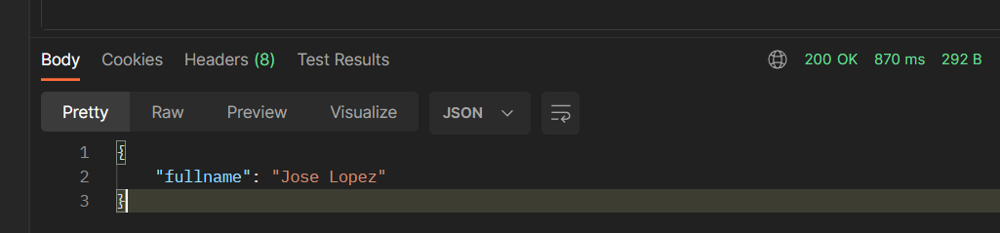
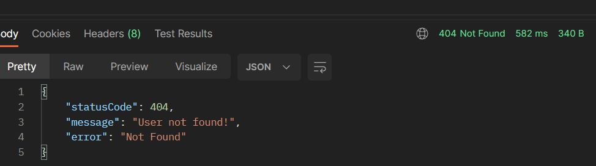
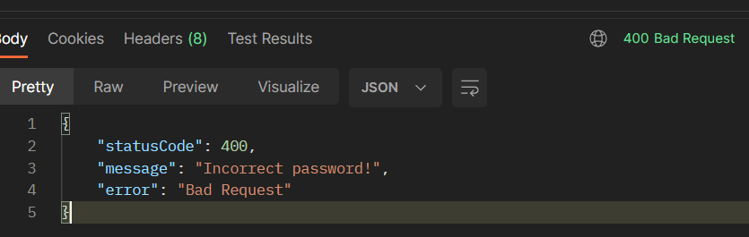

<p align="center">
  <a href="http://nestjs.com/" target="blank"></a>
</p>

<p align="center">A progressive <a href="http://nodejs.org" target="_blank">Node.js</a> framework for building efficient and scalable server-side applications.</p>
  <!--[](https://opencollective.com/nest#backer)
  [](https://opencollective.com/nest#sponsor)-->

## Description

REST service in Nest JS (Node.js framework) that receives the username and password as parameters and returns the user's full name.

## Installation

```bash
$ npm install
```

## Running the app
First, you have to create a file called '.env' similar to the .env-example, completing all variables.

Then...
```bash
# development
$ npm run start

# production
$ npm run start:prod
```
## Running test

```bash
$ npm test
```

## Using the endpoint
POST `http://localhost:8000/users`
### Happy path
```
{
  "username": "admin2", 
  "password": "admin2"
}
```


### User not found
```
{
  "username": "whatever", 
  "password": "admin2"
}
```


### Incorrect password
```
{
    "username": "admin2", 
    "password": "whatever"
}
```
